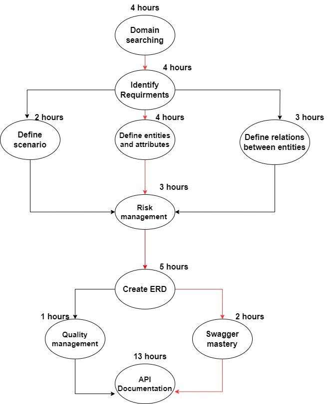

# Supply-Chain-Project
This project represent complete suite of APIs documentation offers a comprehensive suite of RESTful endpoints aimed at automating and enhancing various aspects of the last mile delivery within the supply chain. From managing deliveries, tracking routes, handling user and employee interactions to overseeing warehouse operations.

## Supply Chain ERD

## Critical Path Planning 

## Todo list:
- [X] make a Gantt Chart
- [X] write requirements
- [X] write entities
- [X] analyze requirements and entities
- [X] make changes to the tasks graph and identify the critical route
- [X] make an ERD  
- [X] Swagger Mastery
- [X] Make Open API documentation 

